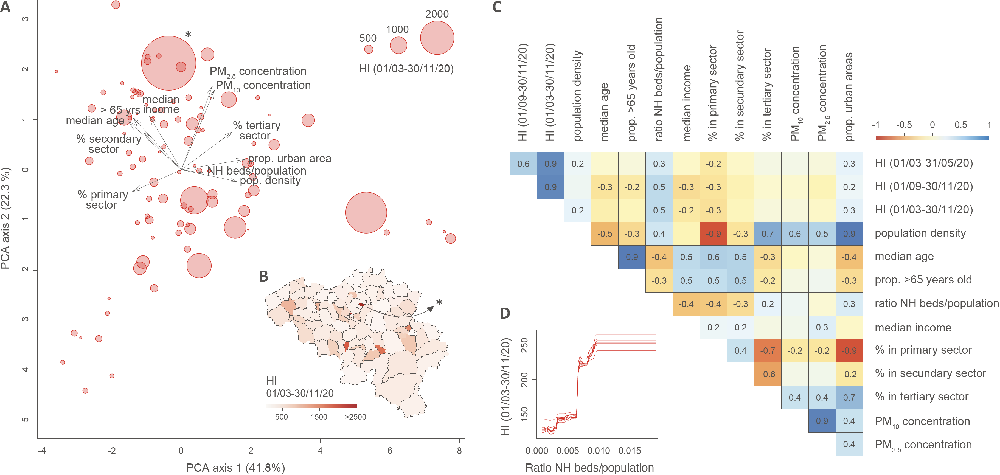

This repo gathers the input files and scripts related to our study entitled "**Investigating the drivers of the spatio-temporal heterogeneity in COVID-19 hospital incidence – Belgium as a study case**" ([Dellicour *et al*. 2021](https://www.nature.com/articles/s41586-023-06471-0), *International Journal of Health Geographics*).

Abstract: The COVID-19 pandemic is affecting nations globally, but with an impact exhibiting significant spatial and temporal variation at the sub-national level. Identifying and disentangling the drivers of resulting hospitalisation incidence at the local scale is key to predict, mitigate and manage epidemic surges, but also to develop targeted measures. However, this type of analysis is often not possible because of the lack of spatially-explicit health data and spatial uncertainties associated with infection. To overcome these limitations, we propose an analytical framework to investigate potential drivers of the spatial-temporal heterogeneity in COVID-19 hospitalisation incidence when data are only available at the hospital level. Specifically, the approach is based on the delimitation of hospital catchment areas, which allows analysing associations between hospitalisation incidence and spatial or temporal covariates. We illustrate and apply our analytical framework to Belgium, a country heavily impacted by two COVID-19 epidemic waves in 2020, both in terms of mortality and hospitalisation incidence. Our spatial analyses reveal an association between the hospitalisation incidence and the local density of nursing home residents, which confirms the important impact of COVID-19 in elderly communities of Belgium. Our temporal analyses further indicate a pronounced seasonality in hospitalisation incidence associated with the seasonality of weather variables. Taking advantage of these associations, we discuss the feasibility of predictive models based on machine learning to predict future hospitalisation incidence. Our reproducible analytical workflow allows performing spatially-explicit analyses of data aggregated at the hospital level and can be used to explore potential drivers and dynamic of COVID-19 hospitalisation incidence at regional or national scales.

Our code is available in R scripts all gathered in `Script_spatial_analyses.r`, which allows (i) delimitating the hospital catchment areas (HCAs), (ii) investigating the drivers of the spatial heterogeneity in COVID-19 hospitalisation incidence, and (iii) investigating the drivers of the temporal variability in COVID-19 hospitalisation incidence. The present repository also contains a specific tutorial dedicated the delimitation of hospital catchment areas (`HCAs_delimitation.pdf`).

**Figure: analyses of the potential predictors of spatial heterogeneity in hospitalisation incidence (HI).** **A**. Principal component analysis (PCA) based on all spatial covariates, each dot corresponding to a distinct hospital catchment area (HCA; see also Figure S2 for an alternative PCA that also includes HI variables). **B**. Map of HCAs coloured by HI value computed for the entire epidemic period under consideration. **C**. Correlogram reporting Spearman correlations among all spatial covariates and HI values for the three considered periods; only significant correlation values (p-values < 0.05) are reported. **D**. Selected result from the boosted regression trees (BRT) analysis performed with all spatial covariates and HI values computed for the entire epidemic period as response variable: partial responses for HI values for the ratio of nursing home (NH) beds divided by the population in each HCA; i.e., the spatial covariate associated with the highest relative influence in the BRT model (~57%; Table 1). (\*) indicates a potential HCA outlier discarded for the statistical analyses reported in Table S2.

